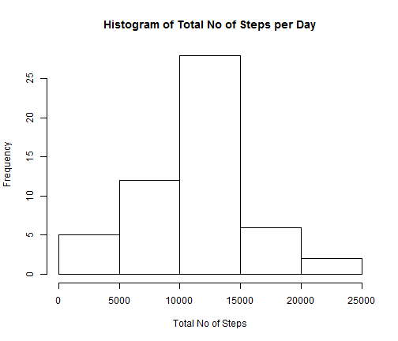
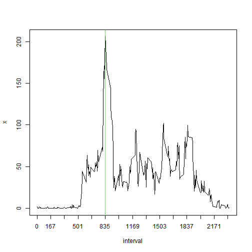
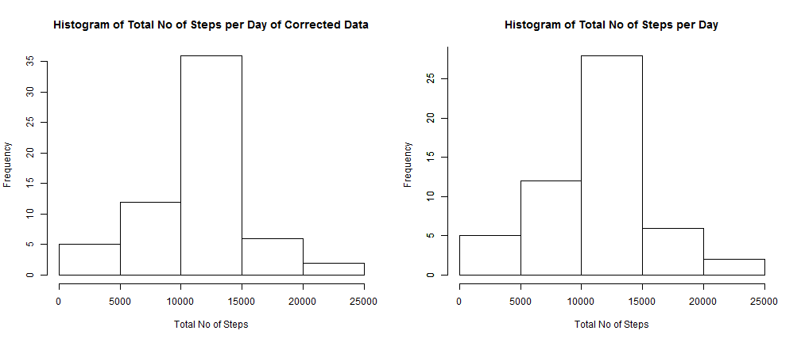
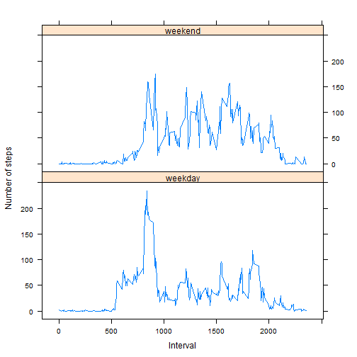

Reproducible Research - Peer Assessment 1
=========================================

Loading and preprocessing the data
----------------------------------

* Load the data (i.e. read.csv())

The code for reading the data makes use of read.csv


```r
rawdata <- read.csv("activity.csv")
originaldata <- rawdata
```


* Process/transform the data (if necessary) into a format suitable for your analysis

In this step, the data is cleaned of NAs in the first column and date data is converted to date format.


```r
cleandata <- rawdata[complete.cases(rawdata), ]
cleandata$date <- as.Date(strptime(cleandata$date, format = "%Y-%m-%d"))
```


What is mean total number of steps taken per day?
-------------------------------------------------

* Make a histogram of the total number of steps taken each day

Aggregate function is used to get the sum of total number of steps per day. Then, hist function is used to generate the histogram.


```r
y <- aggregate(cleandata$steps, by = list(date = cleandata$date), FUN = sum)
hist(y$x, xlab = "Total No of Steps", main = "Histogram of Total No of Steps per Day")
```

 


* Calculate and report the mean and median total number of steps taken per day

Again, the aggregate function is used to calculate the mean of the steps per day. Some dates are missing as they have NAs in steps column. 


```r
meandata <- aggregate(cleandata$steps, by = list(date = cleandata$date), FUN = mean)
meandata
```

```
##          date       x
## 1  2012-10-02  0.4375
## 2  2012-10-03 39.4167
## 3  2012-10-04 42.0694
## 4  2012-10-05 46.1597
## 5  2012-10-06 53.5417
## 6  2012-10-07 38.2465
## 7  2012-10-09 44.4826
## 8  2012-10-10 34.3750
## 9  2012-10-11 35.7778
## 10 2012-10-12 60.3542
## 11 2012-10-13 43.1458
## 12 2012-10-14 52.4236
## 13 2012-10-15 35.2049
## 14 2012-10-16 52.3750
## 15 2012-10-17 46.7083
## 16 2012-10-18 34.9167
## 17 2012-10-19 41.0729
## 18 2012-10-20 36.0938
## 19 2012-10-21 30.6285
## 20 2012-10-22 46.7361
## 21 2012-10-23 30.9653
## 22 2012-10-24 29.0104
## 23 2012-10-25  8.6528
## 24 2012-10-26 23.5347
## 25 2012-10-27 35.1354
## 26 2012-10-28 39.7847
## 27 2012-10-29 17.4236
## 28 2012-10-30 34.0938
## 29 2012-10-31 53.5208
## 30 2012-11-02 36.8056
## 31 2012-11-03 36.7049
## 32 2012-11-05 36.2465
## 33 2012-11-06 28.9375
## 34 2012-11-07 44.7326
## 35 2012-11-08 11.1771
## 36 2012-11-11 43.7778
## 37 2012-11-12 37.3785
## 38 2012-11-13 25.4722
## 39 2012-11-15  0.1424
## 40 2012-11-16 18.8924
## 41 2012-11-17 49.7882
## 42 2012-11-18 52.4653
## 43 2012-11-19 30.6979
## 44 2012-11-20 15.5278
## 45 2012-11-21 44.3993
## 46 2012-11-22 70.9271
## 47 2012-11-23 73.5903
## 48 2012-11-24 50.2708
## 49 2012-11-25 41.0903
## 50 2012-11-26 38.7569
## 51 2012-11-27 47.3819
## 52 2012-11-28 35.3576
## 53 2012-11-29 24.4688
```


Again, the aggregate function is used to calculate the mean of the steps per day. Some dates are missing as they have NAs in steps column. 


```r
mediandata <- aggregate(cleandata$steps, by = list(date = cleandata$date), FUN = median)
mediandata
```

```
##          date x
## 1  2012-10-02 0
## 2  2012-10-03 0
## 3  2012-10-04 0
## 4  2012-10-05 0
## 5  2012-10-06 0
## 6  2012-10-07 0
## 7  2012-10-09 0
## 8  2012-10-10 0
## 9  2012-10-11 0
## 10 2012-10-12 0
## 11 2012-10-13 0
## 12 2012-10-14 0
## 13 2012-10-15 0
## 14 2012-10-16 0
## 15 2012-10-17 0
## 16 2012-10-18 0
## 17 2012-10-19 0
## 18 2012-10-20 0
## 19 2012-10-21 0
## 20 2012-10-22 0
## 21 2012-10-23 0
## 22 2012-10-24 0
## 23 2012-10-25 0
## 24 2012-10-26 0
## 25 2012-10-27 0
## 26 2012-10-28 0
## 27 2012-10-29 0
## 28 2012-10-30 0
## 29 2012-10-31 0
## 30 2012-11-02 0
## 31 2012-11-03 0
## 32 2012-11-05 0
## 33 2012-11-06 0
## 34 2012-11-07 0
## 35 2012-11-08 0
## 36 2012-11-11 0
## 37 2012-11-12 0
## 38 2012-11-13 0
## 39 2012-11-15 0
## 40 2012-11-16 0
## 41 2012-11-17 0
## 42 2012-11-18 0
## 43 2012-11-19 0
## 44 2012-11-20 0
## 45 2012-11-21 0
## 46 2012-11-22 0
## 47 2012-11-23 0
## 48 2012-11-24 0
## 49 2012-11-25 0
## 50 2012-11-26 0
## 51 2012-11-27 0
## 52 2012-11-28 0
## 53 2012-11-29 0
```


What is the average daily activity pattern?
-------------------------------------------

* Make a time series plot (i.e. type = "l") of the 5-minute interval (x-axis) and the average number of steps taken, averaged across all days (y-axis)


```r
intervalmeandata <- aggregate(cleandata$steps, by = list(interval = cleandata$interval), 
    FUN = mean)
head(intervalmeandata)
```

```
##   interval       x
## 1        0 1.71698
## 2        5 0.33962
## 3       10 0.13208
## 4       15 0.15094
## 5       20 0.07547
## 6       25 2.09434
```

```r
plot(intervalmeandata, type = "l", xaxt = "n")
at <- seq(from = 0, to = 2355, by = 167)
axis(side = 1, at = at, tick = TRUE)
abline(v = 835, col = 3, lty = 3)
```

 


* Which 5-minute interval, on average across all the days in the dataset, contains the maximum number of steps?


```r
rownumber <- which.max(intervalmeandata[, 2])
maxvaluedate <- intervalmeandata[rownumber, 1]
message("5-minute interval in which the maximum number of steps were taken is ", 
    maxvaluedate)
```

```
## 5-minute interval in which the maximum number of steps were taken is 835
```


This is also evident from the graph above

Imputing missing values
-----------------------

* Calculate and report the total number of missing values in the dataset (i.e. the total number of rows with NAs)


```r
nodefectrows <- (nrow(rawdata) - nrow(cleandata))
message("The total number of missing values in the dataset is ", nodefectrows)
```

```
## The total number of missing values in the dataset is 2304
```


* Devise a strategy for filling in all of the missing values in the dataset. The strategy does not need to be sophisticated. For example, you could use the mean/median for that day, or the mean for that 5-minute interval, etc.

The simple strategy used here is that missing values are replaced by overall mean of correct data.

* Create a new dataset that is equal to the original dataset but with the missing data filled in.


```r
head(rawdata)
```

```
##   steps       date interval
## 1    NA 2012-10-01        0
## 2    NA 2012-10-01        5
## 3    NA 2012-10-01       10
## 4    NA 2012-10-01       15
## 5    NA 2012-10-01       20
## 6    NA 2012-10-01       25
```

```r
meanofsteps <- round(sum(cleandata[, 1])/nrow(cleandata))
rawdata[is.na(rawdata)] <- meanofsteps
head(rawdata)
```

```
##   steps       date interval
## 1    37 2012-10-01        0
## 2    37 2012-10-01        5
## 3    37 2012-10-01       10
## 4    37 2012-10-01       15
## 5    37 2012-10-01       20
## 6    37 2012-10-01       25
```


Now, rawdata has data filled in with overall mean instead of NAs as shown above.

* Make a histogram of the total number of steps taken each day and Calculate and report the mean and median total number of steps taken per day. Do these values differ from the estimates from the first part of the assignment? What is the impact of imputing missing data on the estimates of the total daily number of steps?


```r
y <- aggregate(rawdata$steps, by = list(date = rawdata$date), FUN = sum)
z <- aggregate(originaldata$steps, by = list(date = originaldata$date), FUN = sum)
op <- par(mfrow = c(1, 2))
hist(y$x, xlab = "Total No of Steps", main = "Histogram of Total No of Steps per Day of Corrected Data")
hist(z$x, xlab = "Total No of Steps", main = "Histogram of Total No of Steps per Day")
axis(2, at = seq(0, 40, by = 5), labels = seq(0, 40, by = 5))
```

 

```r
meancorrecteddata <- aggregate(rawdata$steps, by = list(date = rawdata$date), 
    FUN = mean)
meancorrecteddata
```

```
##          date       x
## 1  2012-10-01 37.0000
## 2  2012-10-02  0.4375
## 3  2012-10-03 39.4167
## 4  2012-10-04 42.0694
## 5  2012-10-05 46.1597
## 6  2012-10-06 53.5417
## 7  2012-10-07 38.2465
## 8  2012-10-08 37.0000
## 9  2012-10-09 44.4826
## 10 2012-10-10 34.3750
## 11 2012-10-11 35.7778
## 12 2012-10-12 60.3542
## 13 2012-10-13 43.1458
## 14 2012-10-14 52.4236
## 15 2012-10-15 35.2049
## 16 2012-10-16 52.3750
## 17 2012-10-17 46.7083
## 18 2012-10-18 34.9167
## 19 2012-10-19 41.0729
## 20 2012-10-20 36.0938
## 21 2012-10-21 30.6285
## 22 2012-10-22 46.7361
## 23 2012-10-23 30.9653
## 24 2012-10-24 29.0104
## 25 2012-10-25  8.6528
## 26 2012-10-26 23.5347
## 27 2012-10-27 35.1354
## 28 2012-10-28 39.7847
## 29 2012-10-29 17.4236
## 30 2012-10-30 34.0938
## 31 2012-10-31 53.5208
## 32 2012-11-01 37.0000
## 33 2012-11-02 36.8056
## 34 2012-11-03 36.7049
## 35 2012-11-04 37.0000
## 36 2012-11-05 36.2465
## 37 2012-11-06 28.9375
## 38 2012-11-07 44.7326
## 39 2012-11-08 11.1771
## 40 2012-11-09 37.0000
## 41 2012-11-10 37.0000
## 42 2012-11-11 43.7778
## 43 2012-11-12 37.3785
## 44 2012-11-13 25.4722
## 45 2012-11-14 37.0000
## 46 2012-11-15  0.1424
## 47 2012-11-16 18.8924
## 48 2012-11-17 49.7882
## 49 2012-11-18 52.4653
## 50 2012-11-19 30.6979
## 51 2012-11-20 15.5278
## 52 2012-11-21 44.3993
## 53 2012-11-22 70.9271
## 54 2012-11-23 73.5903
## 55 2012-11-24 50.2708
## 56 2012-11-25 41.0903
## 57 2012-11-26 38.7569
## 58 2012-11-27 47.3819
## 59 2012-11-28 35.3576
## 60 2012-11-29 24.4688
## 61 2012-11-30 37.0000
```

```r
mediancorrecteddata <- aggregate(rawdata$steps, by = list(date = rawdata$date), 
    FUN = median)
mediancorrecteddata
```

```
##          date  x
## 1  2012-10-01 37
## 2  2012-10-02  0
## 3  2012-10-03  0
## 4  2012-10-04  0
## 5  2012-10-05  0
## 6  2012-10-06  0
## 7  2012-10-07  0
## 8  2012-10-08 37
## 9  2012-10-09  0
## 10 2012-10-10  0
## 11 2012-10-11  0
## 12 2012-10-12  0
## 13 2012-10-13  0
## 14 2012-10-14  0
## 15 2012-10-15  0
## 16 2012-10-16  0
## 17 2012-10-17  0
## 18 2012-10-18  0
## 19 2012-10-19  0
## 20 2012-10-20  0
## 21 2012-10-21  0
## 22 2012-10-22  0
## 23 2012-10-23  0
## 24 2012-10-24  0
## 25 2012-10-25  0
## 26 2012-10-26  0
## 27 2012-10-27  0
## 28 2012-10-28  0
## 29 2012-10-29  0
## 30 2012-10-30  0
## 31 2012-10-31  0
## 32 2012-11-01 37
## 33 2012-11-02  0
## 34 2012-11-03  0
## 35 2012-11-04 37
## 36 2012-11-05  0
## 37 2012-11-06  0
## 38 2012-11-07  0
## 39 2012-11-08  0
## 40 2012-11-09 37
## 41 2012-11-10 37
## 42 2012-11-11  0
## 43 2012-11-12  0
## 44 2012-11-13  0
## 45 2012-11-14 37
## 46 2012-11-15  0
## 47 2012-11-16  0
## 48 2012-11-17  0
## 49 2012-11-18  0
## 50 2012-11-19  0
## 51 2012-11-20  0
## 52 2012-11-21  0
## 53 2012-11-22  0
## 54 2012-11-23  0
## 55 2012-11-24  0
## 56 2012-11-25  0
## 57 2012-11-26  0
## 58 2012-11-27  0
## 59 2012-11-28  0
## 60 2012-11-29  0
## 61 2012-11-30 37
```


Yes, the values definitely differ from the estimates from the first assignment. From a comparison of the graphs of above, the total number of steps against the original data, we can see that the corrected data is definitely inflated. The graphs may have the nearly the same contours but, the scales are different on the y-axis that show the difference. Similarly, the mean and median values are inflated.

Are there differences in activity patterns between weekdays and weekends?
-------------------------------------------------------------------------

* Create a new factor variable in the dataset with two levels – “weekday” and “weekend” indicating whether a given date is a weekday or weekend day.


```r
cleandata["daytype"] <- ifelse((weekdays(as.Date(strptime(cleandata$date, format = "%Y-%m-%d"))) == 
    "Saturday" | weekdays(as.Date(strptime(cleandata$date, format = "%Y-%m-%d"))) == 
    "Sunday"), "weekend", "weekday")
```


_daytype_ is the new factor variable. Now, original date contains the additional column. We are using the cleandata for the last plot as NAs will not allow the last plot to be drawn.

* Make a panel plot containing a time series plot (i.e. type = "l") of the 5-minute interval (x-axis) and the average number of steps taken, averaged across all weekday days or weekend days (y-axis). 


```r
meanplotdata <- aggregate(cleandata$steps, by = list(interval = cleandata$interval, 
    daytype = cleandata$daytype), FUN = mean)
library(lattice)
xyplot(x ~ interval | daytype, data = meanplotdata, type = "l", xlab = "Interval", 
    ylab = expression("Number of steps"), layout = c(1, 2))
```

 


